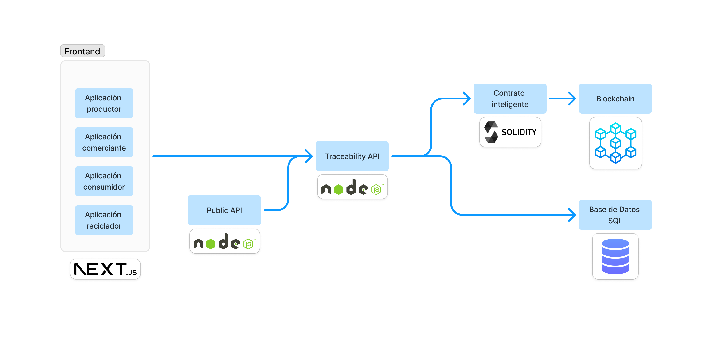

# Sistema de Trazabilidad de Botellas basado en Blockchain

Este proyecto implementa un sistema completo de trazabilidad para el ciclo de vida de botellas de vidrio utilizando tecnología blockchain. El sistema permite rastrear botellas desde su fabricación inicial hasta su reciclaje final, garantizando transparencia e inmutabilidad en los datos a lo largo de toda la cadena de suministro.

## Objetivo

El objetivo principal es proporcionar una plataforma que permita a todos los participantes del ciclo de vida de las botellas (productores primarios, embotelladores, consumidores y recicladores) registrar y consultar información sobre el origen, uso y disposición final de las botellas, promoviendo una economía circular y sostenibilidad ambiental.

## Estructura del Proyecto

El proyecto está organizado en tres componentes principales:

### 1. Blockchain (/blockchain)

Contiene los contratos inteligentes (smart contracts) desarrollados en Solidity que se despliegan en la red Optimistic Ethereum. Estos contratos gestionan:

- Registro de lotes de botellas base (producción primaria)
- Registro de productos embotellados (producción secundaria)
- Registro de materiales reciclados

### 2. Backend API (/backend-api)

Implementa una API RESTful que sirve como capa intermedia entre el frontend y la blockchain. Proporciona:

- Autenticación y autorización de usuarios
- Endpoints para interactuar con los contratos inteligentes
- Almacenamiento y consulta de datos complementarios en base de datos SQL
- Validación de datos y lógica de negocio

### 3. Frontend (/frontend)

Interfaz de usuario desarrollada con Next.js que permite a los diferentes actores interactuar con el sistema de manera intuitiva:

- Interfaces específicas para cada tipo de usuario (productores, embotelladores, consumidores, recicladores)
- Visualización de información de trazabilidad
- Formularios para registro de eventos en la cadena de suministro

## Cómo Empezar

Cada componente tiene su propio README con instrucciones detalladas sobre:

- Requisitos previos
- Configuración del entorno
- Estructura del proyecto
- Ejecución en modo desarrollo
- Pruebas y cobertura de código
- Despliegue en producción

Para comenzar con un componente específico, navega a la carpeta correspondiente y siga las instrucciones en su README.md:

- [Documentación de Blockchain](./blockchain/README.md)
- [Documentación de Backend API](./backend-api/README.md)
- [Documentación de Frontend](./frontend/README.md)

## Integración entre Componentes

- **Blockchain ↔ Backend**: El backend utiliza ether.js para interactuar con los contratos inteligentes desplegados en la blockchain.
- **Backend ↔ Frontend**: El frontend consume la API REST proporcionada por el backend para todas las operaciones.
