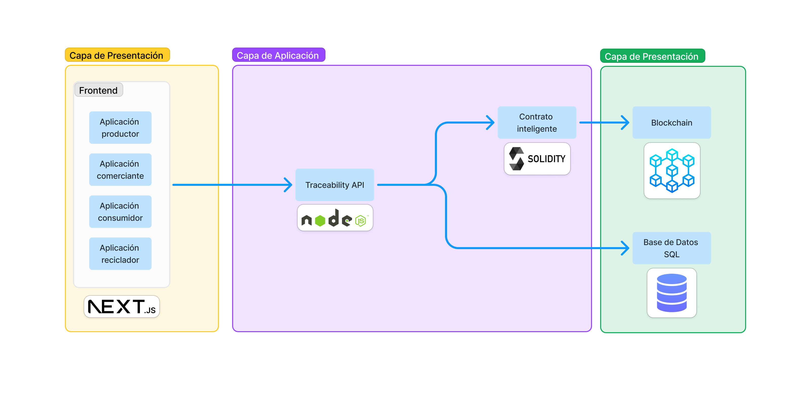
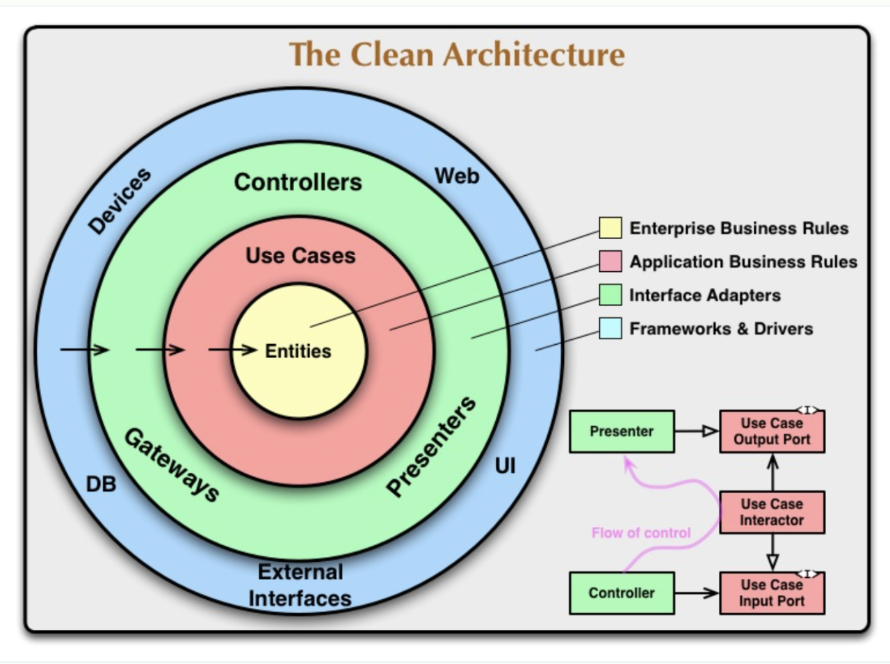
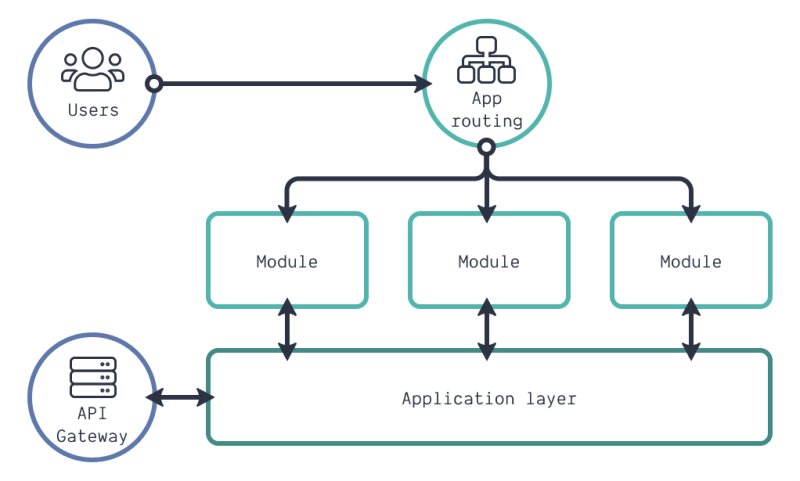

# Arquitectura de Software

## Resumen

### Alcance del proyecto

El alcance de este plan de tesina final de carrera se limita a la **investigación y desarrollo de un prototipo de aplicación** basado en tecnología blockchain, destinado a mejorar la trazabilidad en modelos de economía circular orientados al reciclado de vidrio.

El sistema permitirá registrar y auditar las transacciones de los residuos de vidrio a lo largo de toda la cadena de suministros, desde su generación hasta su disposición final.

Específicamente nos enfocaremos en la cadena de producción de envases de vidrio, dejando a libre implementación futura la integración con otros actores de la cadena de reciclaje de vidrio.

¿Por qué nos concentramos sólo en esta etapa? Porque en la investigación del estado del arte se descubrió que en la primera parte de la cadena no se encontraron soluciones tecnológicas que resuelvan este problema localmente. Mientras que en la segunda parte de la cadena, la recolección y reciclado de vidrio, ya existen soluciones tecnológicas que permiten mejorar la adopción y la eficiencia de los procesos, que pueden ser integradas en futuras etapas del proyecto.

### Alcance de arquitectura de la aplicación

1. Desarrollo de un contrato inteligente (o conjunto de contratos inteligentes) en Solidity para registrar información de envases de vidrio generados y su posterior trazabilidad.

2. Desarrollo de una interfaz web para interactuar con el contrato inteligente desde el punto de vista de los distintos actores y visualizar la información registrada en la blockchain.

3. Desarrollo de una base de datos para almacenar información adicional de los envases de vidrio generados y reciclados y otra información relevante para la trazabilidad o uso del software.

4. Desarrollo de una API para interactuar con la base de datos y el contrato inteligente.

5. Desarrollo de una API Pública y su documentación para permitir la integración con otros sistemas empresariales, gubernamentales o de terceros.

#### Justificación

Esta arquitectura se ha diseñado buscando maximizar la escalabilidad y flexibilidad. Consideramos que estas características son clave para manejar la trazabilidad en las cadenas de suministro, garantizando al mismo tiempo la integridad y la accesibilidad de los datos a través de diferentes actores del ecosistema. Eesta arquitectura no solo cumple con los requisitos técnicos y de negocio de la aplicación actual, sino que busca posicionar el sistema para escalabilidad futura, integración con sistemas nuevos o preexistentes y adaptación a nuevas necesidades o cambios de tecnología.

- Blockchain: Utilizar una tecnología de blockchain para registrar las operaciones garantiza no solo la seguridad y la transparencia, sino también la resistencia a la censura y la manipulación de los registros, factores cruciales cuando se manejan certificaciones y se verifica la procedencia de materiales sensibles en un entorno distribuido con múltiples actores con intereses diversos. Para mayor análisis, dirigirse a la sección de Tecnologías.

- Solidity: se eligió Solidity/Ethereum por ser una blockchain pública e interoperable y con una amplia comunidad de desarrolladores y herramientas disponibles para el desarrollo de contratos inteligentes y un lenguaje de programación simple para la creación de contratos inteligentes.

- Node.js en la API de trazabilidad: El uso de Node.js para desarrollar la API de trazabilidad se debe a que esta API debe comunicarse con la blockchain y actualmente Node.js cuenta con la mayor colección de librerías y herramientas que facilitan la interacción con la red Ethereum y redes compatibles con Solidity, además de una amplia comunidad detrás de estas herramientas. A su vez, Node.js es ideal para operaciones de I/O intensivas y para la gestión de múltiples conexiones simultáneas, lo cual es esencial para el procesamiento en tiempo real necesario en las operaciones de la API de trazabilidad. Esta API seguirá una arquitectura basada en Clean Architecture, que permite separar las capas de presentación, aplicación, dominio e infraestructura, facilitando la escalabilidad del sistema y la integración con otros sistemas de terceros.

- Base de Datos SQL: el uso de una base de datos SQL tradicional permite gestionar de manera eficiente los datos estructurados generados por las aplicaciones, facilitando operaciones complejas de consulta y análisis para la toma de decisiones estratégicas y operacionales por parte de las empresas y entidades regulatorias. A su vez, duplicar la información de la blockchain en una base de datos SQL permite garantizar la disponibilidad de los datos en caso de congestión en la red blockchain, a modo de caché para mejorar la velocidad de respuesta de las aplicaciones y reducir la latencia en la interacción con los usuarios. Esta base de datos se sincronizará con la blockchain a través de la API de trazabilidad, garantizando la consistencia y la integridad de los datos en ambos sistemas.

- Frontend con Next.js: Se ha optado por un frontend web usando el framework Next.js para generar una interfaz accesible desde todo tipo de dispositivos modernos (y no tan modernos), aprovechando la simplicidad de desarrollo que ofrece y la disponibilidad de librerías creadas por la comunidad para un desarrollo acelerado ideal para prototipos, aprovechando a su vez el rendimiento mejorado para el usuario final que ofrece el framework al combinar páginas estáticas con otras renderizadas en el servidor. Esto optimiza la carga y rendimiento de las aplicaciones de productor, comerciante, consumidor y reciclador, proporcionando una experiencia de usuario fluida y rápida, que es esencial para fomentar la adopción del sistema por usuarios con diversas competencias tecnológicas.

## Detalle

### Arquitectura del sistema

Diseño modular: Desarrollar con una arquitectura que favorezca . Permite además una mejor distribución del trabajo en equipo.

Para este proyecto se decidió utilizar una arquitectura modular y por capas, diseñando el sistema dividido en módulos independientes, lo que facilita la mantenibilidad y la escalabilidad. En este trabajo, separamos los módulos en 3 capas principales, cada una con una responsabilidad clara y bien definida:

1. **Capa de Presentación**: Interfaz de usuario web para interactuar con el sistema.
2. **Capa de Aplicación**: API de trazabilidad para interactuar con la blockchain y la base de datos.
3. **Capa de Dominio**: base de datos en blockchain para registrar la trazabilidad de los envases de vidrio y base de datos SQL para almacenar información adicional de las aplicaciones.

En este esquema, cada capa tiene una responsabilidad clara y se comunica con las otras capas a través de interfaces bien definidas. Cada capa puede tener múltiples módulos y cada módulo puede ser desarrollado, probado, desplegado y remplazado de forma independiente, facilitando la escalabilidad y la integración con otros sistemas. Características clave de esta arquitectura son:

- Desacoplamiento: cada capa es independiente, lo que facilita su modificación sin afectar las demás capas.
- Separación de responsabilidades: cada capa tiene una responsabilidad clara y bien definida, lo que facilita el mantenimiento y escalabilidad del sistema.
- Escalabilidad: permite escalar verticalmente (dentro de una capa) o horizontalmente (distribuyendo las capas en distintos servidores).

La comunicación entre cada capa y cada módulo se realizará a través de APIs RESTful, que permiten una comunicación asíncrona y desacoplada entre los distintos componentes del sistema. Esto facilita la integración con otros sistemas y la escalabilidad del sistema, ya que cada capa puede ser desplegada en servidores independientes y comunicarse a través de la red. Incluso cada módulo puede ser reemplazado independientemente sin afectar al resto del sistema, siempre y cuando se mantengan las mismas interfaces definidas.

#### Estructura de capas

Este sistema está pensado desde el punto de vista de la trazabilidad de los envases de vidrio, por lo que la capa de dominio es la más crítica y sensible del sistema, ya que es la que se encarga de registrar la trazabilidad de los envases de vidrio generados y reciclados. Las demás capas son simplemente interfaces para interactuar con la capa de dominio, por lo que pueden ser modificadas o reemplazadas sin afectar la integridad y la seguridad de los datos almacenados en la blockchain.

La interfaz de la capa de dominio es el contrato inteligente en Solidity, que se encarga de registrar la trazabilidad de los envases de vidrio generados y reciclados. Este contrato inteligente se desplegará en una red de blockchain pública. Esta interfaz no cambiará a lo largo del tiempo, ya que es la parte crítica y sensible del sistema, y cualquier cambio en ella podría afectar la integridad y la seguridad de los datos almacenados en la blockchain.

Para este prototipo es especialmente útil, ya que nos concentraremos especialmente en desarrollar la lógica de trazabilidad de los envases de vidrio en el contrato inteligente utilizando la blockchain como base de datos, pero el resto de las capas pueden ser desarrolladas y desplegadas por separado, permitiendo una mayor flexibilidad y adaptabilidad a futuras necesidades.

Es por este motivo que se decidió agregar una API de trazabilidad entre la capa de presentación y la capa de dominio junto con una base de datos SQL, para permitir la integración con otros sistemas sin tener que modificar el contrato inteligente en Solidity, que es la parte más crítica y sensible del sistema. El contrato inteligente poseerá su interfaz bien definida y documentada con la cuál podrá interactuar la API de trazabilidad para enviar y consultar información, pero esta interfaz no debería ser modificada a lo largo del tiempo, sino que se mantendrá estática y estable.

La forma de extender la funcionalidad del sistema será a través de la capa de aplicación, desarrollando nuevas funcionalidades en la API de trazabilidad y en la base de datos SQL, pero sin modificar el contrato inteligente en Solidity. Incluso en un futuro podrían desarrollarse múltiples APIs o cambiar el módulo completo de la API de trazabilidad sin tener que modificar el contrato inteligente, siempre y cuando se respete la interfaz definida.

Elegimos utilizar API REST para definir la interacción entre los distintos módulos del sistema, ya que es un estándar de facto en la industria y permite una comunicación asíncrona y desacoplada entre los distintos componentes del sistema. Incluso el estándar entre las bases de datos blockchain es exponer una API Rest para la interacción con la blockchain. Además, es muy sencillo de implementar y de entender, lo que facilita la integración con otros sistemas y la reutilización de código. En un futuro, si se requiere, se podría cambiar a otro tipo de API, como GraphQL, gRPC, WebSockets, etc., pero por ahora consideramos que API REST es la mejor opción para este proyecto, dado que uno de los requerimientos del sistema es exponer una API pública para facilitar la integración con otros sistemas, la mejor decisión es utilizar el estándar de facto en la industria para garantizar la compatibilidad y la interoperabilidad con otros sistemas.

API rest utiliza el protocolo HTTP y el formato JSON para la comunicación de mensajes entre sistemas, lo que lo hace muy sencillo de implementar y de entender. Además, es un estándar de facto en la industria, lo que facilita la integración con otros sistemas y la reutilización de código. Otras alternativas podrían ser GraphQL, gRPC, WebSockets, etc. Pero para este proyecto se consideró que API REST era la mejor opción por su simplicidad y facilidad de implementación y futura escalabilidad en caso de que otros sistemas quieran integrarse con el nuestro en el futuro.

En la capa de aplicación elegimos hacer una sola api, estilo mono repo, para simplificar el desarrollo y la integración de los distintos módulos. En un futuro, si se requiere, se podría dividir en distintas apis para cada módulo, pero por ahora consideramos que es suficiente con una sola api. Para mantener el orden dentro de esta única api, utilizaremos una arquitectura basada en Clean Architecture, que nos permitirá separar las capas de presentación, aplicación, dominio e infraestructura, facilitando la escalabilidad del sistema y la integración con otros sistemas de terceros. (acá definir si clean u otra arquitectura).

La capa de presentación en este trabajo se implementó para poder dar una presentación visual del proyecto, pero en un futuro, cuando el sistema sea usado en producción, nuestra api se conectará directamente a aplicaciones preexistentes de los distintos actores de la cadena de suministro, como por ejemplo un sistema de gestión de producción de envases de vidrio, un sistema de gestión de ventas de envases de vidrio, un sistema de gestión de reciclado de envases de vidrio, etc. Incluso podríamos desarrollar aplicaciones a medida para cada actor a pedido si es necesario, ya que nuestra arquitectura lo permite.

#### Blockchain

[En la sección technologies del informe de tesina se explica por qué se eligió blockchain y Solidity para este proyecto. Empalmar con eso].

Dado que elegimos Solidity como lenguaje de programación para el contrato inteligente y la blockchain elegida para desplegar el contrato inteligente será Ethereum, los mecanismos de consenso se heredan de la red Ethereum, que actualmente utiliza un mecanismo de consenso de Prueba de Trabajo (PoW) mixto con un mecanismo de consenso de Prueba de Participación (PoS) con la actualización Ethereum 2.0.

Para este trabajo, elegimos decantarnos por el mecanismo de consenso PoS debido a que es más eficiente energéticamente y permite una mayor escalabilidad de la red, lo que es fundamental para garantizar la disponibilidad y la integridad de los datos almacenados en la blockchain. Además, Ethereum 2.0 es una actualización de la red Ethereum que se espera que se complete en los próximos años, por lo que es una elección a futuro que garantiza la escalabilidad y la eficiencia energética del sistema. Dado que uno de los objetivos finales de este sistema es aportar positivamente al medio ambiente, consideramos que elegir tecnologías que sean sostenibles y eficientes energéticamente está en línea con los valores del proyecto.

Dado que en las redes blockchain se debe pagar una comisión por cada transacción impactada, se debe tener en cuenta que el costo de las transacciones en la red Ethereum puede ser elevado para una aplicación con constante movimiento de datos, como es el caso de una aplicación de trazabilidad de envases de vidrio que registra cada movimiento de los envases a lo largo de la cadena de suministro. Este costo podría hacer inviable económicamente el uso del sistema tras su despliegue. Para mitigar este problema, se pueden utilizar soluciones de capa 2, como por ejemplo rollups o sidechains, entre otros, que permiten realizar transacciones fuera de la cadena principal de Ethereum y luego sincronizarlas con la cadena principal, reduciendo los costos y aumentando la escalabilidad del sistema, mientras mantiene la seguridad, accesibilidad e integridad de los datos almacenados en la blockchain.

Por este motivo, elegimos desplegar el contrato en un Rollup de capa 2, que permite reducir costos sin modificar la interfaz del contrato inteligente, ni la estrategia de despliegue del sistema ni la forma en que otras APIs interactúan con el contrato. De esta forma, el sistema es más eficiente económicamente y puede escalar mejor en el tiempo, sin afectar la integridad y la seguridad de los datos almacenados en la blockchain. El contrato será desplegado en una red de prueba de Ethereum, como Polygon, Arbitrum u Optimism, que son las redes de capa 2 más populares y con mayor soporte en la actualidad. Mientras que su interfaz es la misma, la diferencia radica en su costo y velocidad de transacción, que son mucho menores en las redes de capa 2 que en la red principal de Ethereum. Entre sí, estas 3 opciones sólo difieren en la forma en que se realizan las transacciones y en la forma en que se garantiza la seguridad de los datos almacenados en la blockchain, pero la interfaz del contrato inteligente y la forma en que interactúa con otras APIs no cambia, garantizando una buena experiencia de desarrollo.

Como framework de desarrollo y despeliegue de contratos inteligentes en Solidity, se eligió Hardhat, que es uno de los frameworks más populares y con mayor soporte en la actualidad para esta tecnología. Hardhat permite desarrollar, testear y desplegar contratos inteligentes en Solidity de forma sencilla y eficiente, además de contar con una amplia documentación y una comunidad activa que facilita el desarrollo y la resolución de problemas. Hardhat es ideal para el desarrollo de contratos inteligentes en Solidity, ya que permite realizar pruebas unitarias y de integración de forma sencilla y eficiente, lo que garantiza la calidad y la seguridad del contrato inteligente antes de su despliegue en la red de blockchain.

### Base de datos SQL

En el sistema incluiremos una base de datos SQL complementaria a la blockchain en la capa de dominio para almacenar información adicional de los envases de vidrio generados y reciclados y otra información relevante para la trazabilidad, gestión de usuarios o uso del frontend. La base de datos SQL se mantendrá sincronizada con la blockchain a través de la API de trazabilidad, garantizando la consistencia y la integridad de los datos en ambos sistemas. Dentro de la documentación del sistema incluiremos un Diagrama Entidad Relación detallando la estructura de la base de datos SQL y su relación con la blockchain.

Este tipo de base de datos nos permite un uso fluido del sistema y nos permite realizar operaciones complejas de consulta y análisis para la toma de decisiones estratégicas y operacionales por parte de las empresas y entidades regulatorias, que no serían posibles de realizar directamente en la blockchain, dado que la blockchain es una base de datos no relacional y no permite realizar operaciones complejas de consulta y análisis.

Posiblemente la información de la blockchain sea duplicada en la base de datos SQL para garantizar la disponibilidad de los datos en caso de congestión en la red blockchain, a modo de caché para mejorar la velocidad de respuesta de las aplicaciones y reducir la latencia en la interacción con los usuarios. Esta base de datos se sincronizará con la blockchain a través de la API de trazabilidad, garantizando la consistencia y la integridad de los datos en ambos sistemas. La sincronización se realiza en tiempo real, de forma que cualquier cambio en la blockchain se refleje automáticamente en la base de datos SQL y viceversa.

### Capa de Aplicación

La capa de aplicación es la encargada de implementar la lógica de negocios del sistema, esta capa recibe las peticiones de la capa de presentación, procesa la información y se comunica con la capa de dominio para realizar las operaciones de escritura y lectura necesarias en la blockchain y en la base de datos SQL. En la capa de aplicación contaremos con una única API de trazabilidad que se encargará de interactuar con la capa de presentación y la capa de dominio, facilitando la comunicación entre los distintos módulos del sistema. La capa de aplicación expone una API RESTful a la capa de presentación, que permite una comunicación desacoplada entre ambos componentes del sistema.

Los patrones de arquitectura de software en el desarrollo de API REST proporcionan estructuras probadas para solucionar problemas comunes de diseño y implementación. La API de trazabilidad debe seguir un patrón de arquitectura que permita separar las responsabilidades del sistema de forma tal que garantice la escalabilidad y mantenibilidad del sistema, teniendo en vista que esta aplicación es propensa a cambios en el tiempo debido a que será integrada de forma flexible con múltiples y diversos sistemas de terceros y debe ser capaz de adaptarse a futuras necesidades. A su vez, elegir un patrón de arquitectura nos permite elegir un framework de desarrollo y una estructura de carpetas y archivos estándar compatible con el patrón elegido que facilita el desarrollo, la integración con otros sistemas y la mantenibilidad del sistema en el tiempo.

Para maximizar la mantenibilidad del sistema, se eligió un patrón entre los patrones para APIs RESTful con mayor adopción en la actualidad. Entre ellos se encuentran: Clean Architecture, Hexagonal Architecture, Model View Controller, entre otros. Estos patrones permiten separar la implementación de la API en capas independientes, cada una con una responsabilidad clara y bien definida, lo que facilita la escalabilidad y mantenibilidad del sistema.

1. **Modelo Vista Controlador (MVC)**: MVC es uno de los patrones de diseño más utilizados para el desarrollo de aplicaciones web y APIs. En este modelo, la aplicación se divide en tres componentes interconectados, lo que permite una separación eficiente de las responsabilidades. En una API REST, el controlador maneja las solicitudes HTTP, el modelo gestiona la lógica de negocio y los datos, y la vista se simplifica a la representación de la respuesta (JSON en una API Restful).

2. **Clean Architecture**: Esta arquitectura, propuesta por Robert C. Martin, organiza el código para separar claramente las funciones del negocio de las infraestructuras y las interfaces de usuario. Se basa en la independencia de frameworks, la testabilidad, y la independencia de la UI, la base de datos y cualquier agente externo. Clean Architecture enfatiza la separación mediante capas concéntricas donde cada una tiene reglas estrictas sobre cómo puede ser accedida.

3. **Arquitectura de Microservicios**: En vez de desarrollar una aplicación monolítica, los microservicios estructuran una aplicación como una colección de servicios pequeños y autónomos, cada uno ejecutándose en su propio proceso y comunicándose mediante mecanismos ligeros, como API HTTP. Cada servicio es independiente, lo que permite actualizar, desplegar y escalar cada servicio de forma independiente. Este modelo no especifica cómo se deben implementar los servicios, sino cómo separarlos y comunicarlos.

4. **Arquitectura Hexagonal (Puertos y Adaptadores)**: Esta arquitectura se enfoca en la separación de la lógica de negocio de los detalles externos como bases de datos, UI o servicios externos. El núcleo de la aplicación (la lógica de negocio) interactúa con el exterior (dispositivos de entrada/salida) a través de puertos y adaptadores, lo que permite cambiar los componentes de entrada/salida sin afectar el núcleo de la aplicación.

Cada uno de estos modelos de arquitectura ofrece un enfoque sistemático y estructurado para el diseño y la implementación de APIs REST, proporcionando distintos beneficios según los requerimientos y características específicas del proyecto.

Para este proyecto, desestimamos el uso de Arquitectura de Microservicios debido al pequeño tamaño del dominio del sistema, ya que esta arquitectura es más adecuada para sistemas grandes y complejos con múltiples servicios y bases de datos independientes. Preferimos el uso de otros patrones de arquitectura más simples y fáciles de implementar, pero que permitan separar el sistema en módulos según su dominio.

Tanto MVC como Clean Architecture y Hexagonal Architecture son patrones de arquitectura de software que permiten separar las responsabilidades del sistema en capas independientes, separando la lógica de negocios de la UI y de la infraestructura. Si bien las tres arquitecturas son válidas para el desarrollo de APIs RESTful, en este proyecto se decidió utilizar Clean Architecture, por sobre los otros dos modelos.

MVC se despriorizó debido a que está más centrado en la interfaz de usuario y es menos ideal para APIs que no interactúan directamente con el usuario. Si bien la API de traabilidad interactuará con una interfaz de usuario web, esto no necesariamente será así para todos los sistemas con los que se integrará en el futuro, por lo que se prefirió un modelo más centrado en la lógica de negocio y la escalabilidad. MVC no es un modelo ideal para aplicaciones que requieran muchos cambios en el tiempo, ya que la separación de responsabilidades no es tan clara, mientras que en este sistema se espera que la lógica de negocio cambie y se adapte a la hora de integrar con otros sistemas.

Hexagonal Architecture se despriorizó debido a que es más compleja de implementar y menos común en la industria, lo que podría dificultar la mantenibilidad del sistema en el futuro. Si bien es un modelo válido y efectivo para separar la lógica de negocio de la infraestructura, su foco está más en la separación de la lógica de negocio de la infraestructura que en la escalabilidad y mantenibilidad del sistema, mientras que en este sistema la infraestructura se mantendrá estable a lo largo del tiempo.

Clean Architecture fue elegido finalmente ya que es un patrón de arquitectura de software que permite separar las capas de presentación, aplicación, dominio e infraestructura, facilitando la escalabilidad del sistema y la integración con otros sistemas de terceros. Clean Architecture enfatiza la independencia de frameworks, la testabilidad, y la independencia de la UI, la base de datos y cualquier agente externo. Además, Clean Architecture es un modelo de arquitectura de software ampliamente utilizado en la industria, lo que facilita la integración con otros sistemas y la mantenibilidad futura. Mientras que en nuestra aplicación consideramos que la infraestructura de base de datos será estable a lo largo del tiempo, sí contemplamos que la presentación podrían cambiar en el futuro al integrarse con distintos sistemas, pudiendo necesitarse cambios también en la lógica de negocios, motivos por los cuales Clean Architecture resulta apropiado para este proyecto, debido a que permite separar claramente las funciones del negocio de las infraestructuras y las interfaces de usuario. A su vez, este modelo permite separar las responsabilidades del sistema en módulos independientes según dominio o sistema externo con el que se integre, lo que facilita la escalabilidad y mantenibilidad del sistema en módulos desacoplados.

/// Insertar diagrama de arquitectura de routers, handlers y domain services específico del proyecto.

Haber elegido un patrón de arquitectura definido nos permite tener más claridad a la hora de elegir un framework de desarrollo para API Rest en Node.js. En principio, Express\footnote{https://expressjs.com/} es el framework de facto para el desarrollo de APIs RESTful en Node.js, pero existen múltiples frameworks que extienden las funcionalidades de Express y facilitan el desarrollo de APIs RESTful en Node.js. Entre ellos se encuentran Nest.js, Koa, Hapi, Fastify, entre otros. Estos frameworks permiten desarrollar APIs RESTful de forma rápida y eficiente, aprovechando las ventajas de Node.js y Express, pero añadiendo funcionalidades adicionales que facilitan el desarrollo y la mantenibilidad de las APIs RESTful.

Ninguno de los frameworks nombrados está construido específicamente para brindar soporte a Clean Architecture, pero algunos de ellos permiten implementar una arquitectura basada en Clean Architecture a través de la organización de los archivos y carpetas del proyecto.

En este proyecto, decidimos utilizar el framework Nest.js\footnote{https://docs.nestjs.com/} para desarrollar la API de trazabilidad, ya que es un framework que permite implementar una arquitectura basada en Clean Architecture de forma sencilla y eficiente, aprovechando las ventajas de Node.js y Express, pero añadiendo funcionalidades adicionales que facilitan el desarrollo y la mantenibilidad de las APIs RESTful. Nest.js es un framework construido sobre los frameworks y librerías más utilizados la industria en Node.js, como Express, TypeScript y RxJS, lo que garantiza la compatibilidad y la interoperabilidad con otros sistemas y librerías de terceros. A su vez, Nest.js permite organizar el código en módulos, controladores, servicios y pipes, lo que facilita la implementación de una arquitectura basada en Clean Architecture en el proyecto. Este framework es utilizado en la industria y cuenta con una amplia documentación y una comunidad activa que facilita el desarrollo y la resolución de problemas.

### Capa de Presentación

La capa de presentación es la interfaz de usuario web que permite a los distintos actores de la cadena de suministro interactuar con el sistema de trazabilidad de envases de vidrio.

En esta capa se desarrollarán las interfaces de usuario específicas para cada actor de la cadena de suministro (productores, comerciantes, consumidores, recicladores) que interactuarán con el sistema de trazabilidad a modo de prototipo. Estas interfaces permitirán a los actores realizar las operaciones de registro, consulta y auditoría de los envases de vidrio generados y reciclados, así como visualizar la trazabilidad de los envases a lo largo de la cadena de suministro.

Estas interfaces serán a modo de prototipo ya que el valor real del sistema está en su API flexible que permite la integración con otros sistemas de terceros, por lo que en un futuro estas interfaces podrían ser reemplazadas por aplicaciones móviles, sistemas de gestión empresarial, sistemas de gestión de producción, sistemas de gestión de ventas, sistemas de gestión de reciclado, entre otros, que se integren con la API de trazabilidad para mejorar la trazabilidad y la eficiencia de la cadena de suministro de envases de vidrio para los distintos actores, teniendo en cuenta las necesidades, requerimientos específicos y competencias tecnológicas previas de cada actor.

Para el desarrollo de la capa de presentación se utilizará el framework Next.js, que permite desarrollar aplicaciones web modernas y rápidas con React.js, aprovechando la simplicidad de desarrollo que ofrece y la disponibilidad de librerías creadas por la comunidad para un desarrollo acelerado ideal para prototipos. Next.js es ideal para aplicaciones web modernas que requieren una carga y rendimiento optimizados, ya que combina páginas estáticas con páginas renderizadas en el servidor, lo que mejora la velocidad de carga y la experiencia de usuario final. Este framework se utilizará en combinación con librerías de diseño como Material-UI y Tailwind CSS para desarrollar interfaces de usuario funcionales y agradables para sus usuarios.

La capa de presentación se comunicará con la capa de aplicación a través de la API de Trazabilidad, lo que permite una comunicación asíncrona y desacoplada entre ambos sistema. La API de Trazabilidad expone una interfaz RESTful que permite a la capa de presentación realizar operaciones de lectura y escritura en la blockchain y en la base de datos SQL, garantizando la integridad y la seguridad de los datos almacenados en ambos sistemas. Esta API maneja las solicitudes enviadas por la capa de presentación y devuelve información en un formato interpretable y práctico para su uso en la capa de presentación.

La capa de presentación se implementará como un único repositorio Next.js separado en 4 módulos independientes, uno para cada actor de la cadena de suministro (productor, comerciante, consumidor, reciclador), cada uno con su propia interfaz de usuario y funcionalidades específicas. Cada módulo compartirá la misma estructura de carpetas y archivos, pero con ligeras variaciones en el contenido y la lógica de negocio, a su vez que utilizará los mismos componentes y librerías de diseño para mantener la coherencia visual y la consistencia de la interfaz de usuario a lo largo de todo el sistema.

Para el desarrollo frontend web no existe en la industria un patrón de diseño de facto que especifique cómo se deben estructurar las aplicaciones web, pero existen varios patrones de diseño que se utilizan comúnmente en la industria para estructurar aplicaciones web modernas y escalables. Entre ellos se encuentran Atomic Design, Component Driven Development, BEM, SMACSS, entre otros. Estos patrones de diseño permiten estructurar las aplicaciones web de forma modular y escalable, facilitando el desarrollo y la mantenibilidad de las aplicaciones a lo largo del tiempo.

En este proyecto, implementaremos el patrón Component Driven Development, que es una metodología de desarrollo de software que se basa en la creación de componentes reutilizables y modulares, que se organizan en una biblioteca de componentes y se utilizan para construir interfaces de usuario de forma rápida y eficiente. Component Driven Development se basa en la idea de que las interfaces de usuario se pueden descomponer en componentes más pequeños y reutilizables, que se organizan en una biblioteca de componentes y se utilizan para construir interfaces de usuario de forma modular y escalable, facilitando el desarrollo y la mantenibilidad de las aplicaciones frontend a lo largo del tiempo.

A su vez, implementaremos una estructura de módulos por capas, que se basa en separar la funcionalidad de la aplicación en módulos según casos de uso o dominio. Mientras que cada módulo se subdivide en vistas, componentes y servicios, que se organizan en carpetas y archivos según su funcionalidad y responsabilidad. Esta estructura de módulos por capas facilita la escalabilidad y mantenibilidad de la aplicación, ya que permite separar la lógica de negocio de la interfaz de usuario y de la infraestructura, lo que facilita la integración con otros sistemas.

